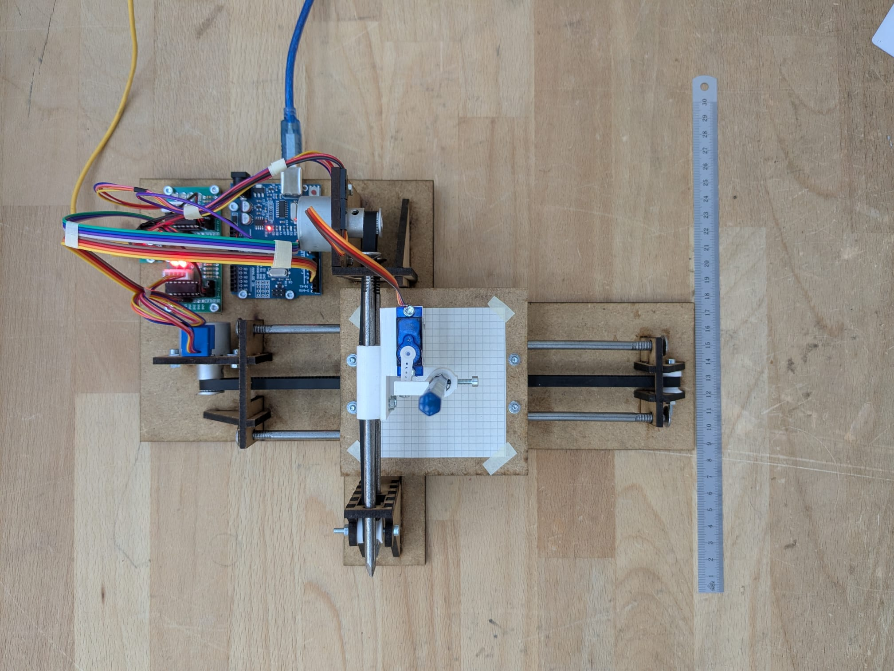
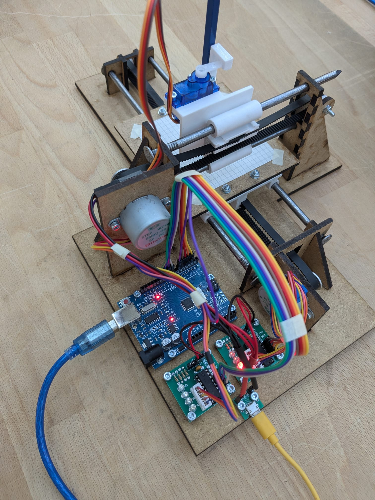
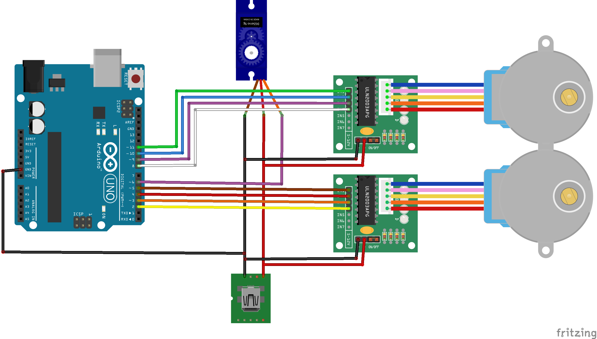
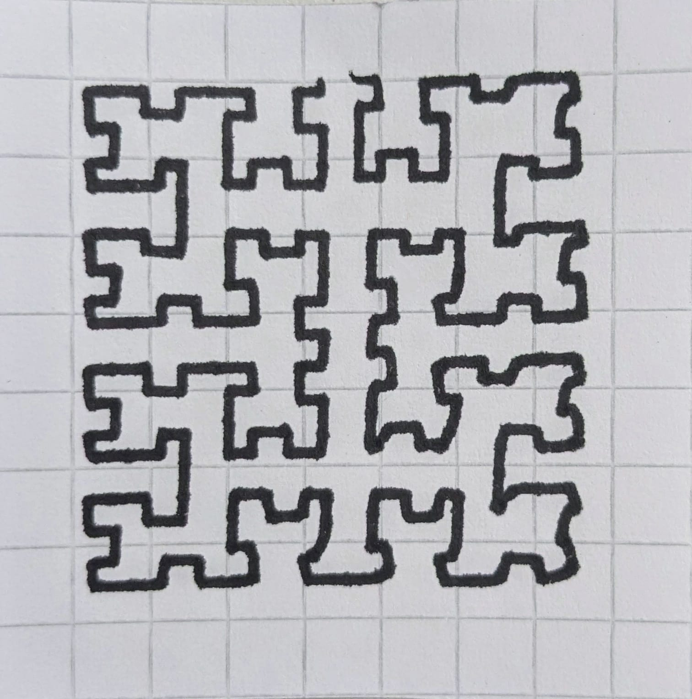
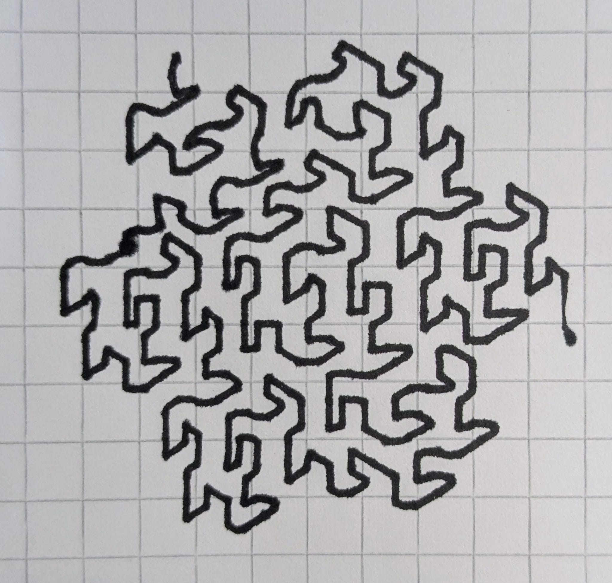
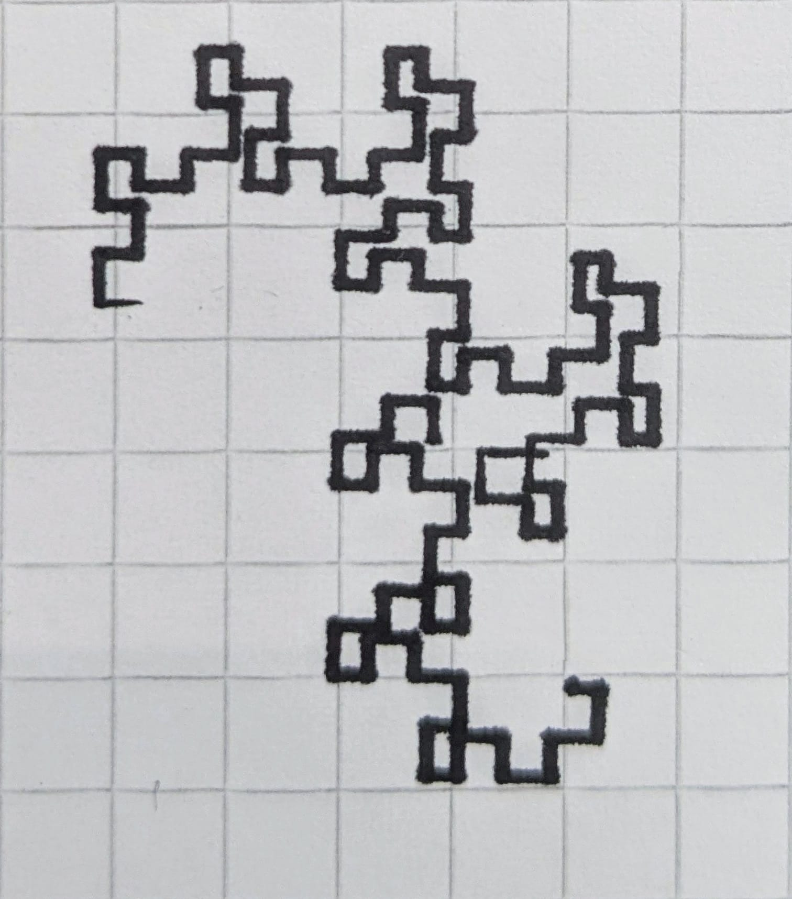
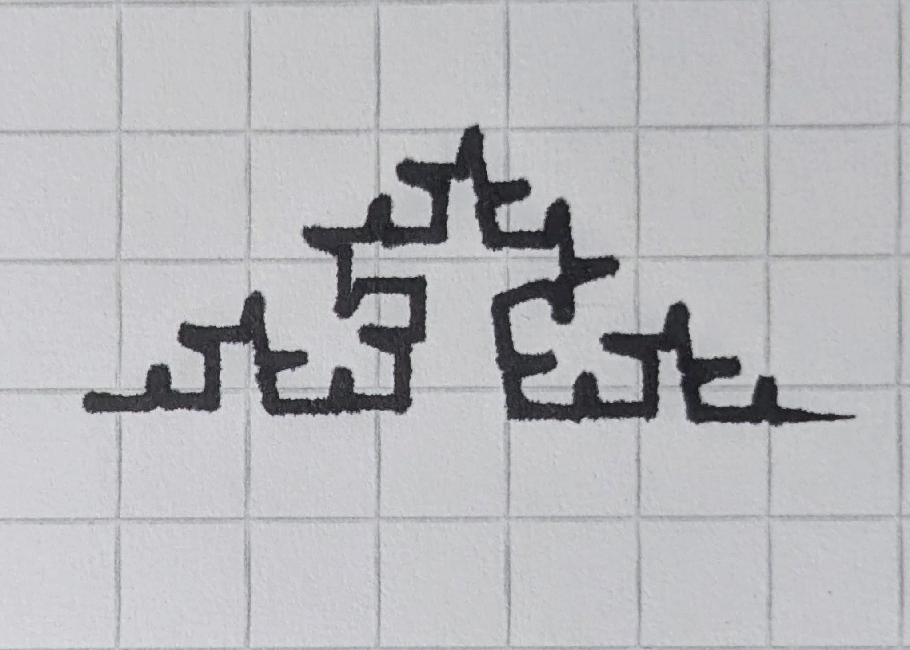
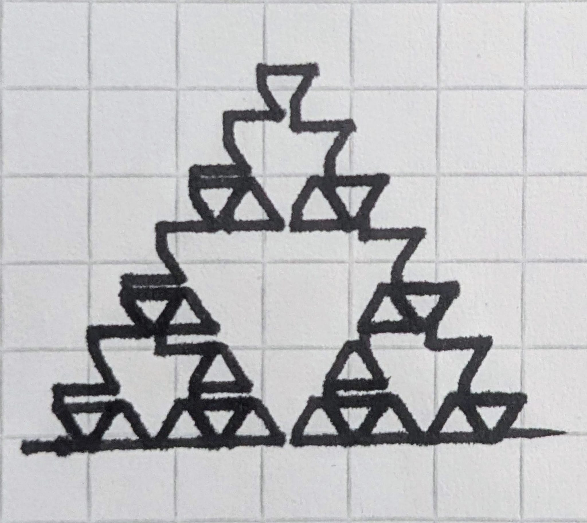

# 2D Plotter Project

## Overview
This project showcases the development of a **2D plotter**, a machine capable of drawing complex fractal patterns using **L-systems**. The plotter consists of two stepper motors controlling the X and Y axes, along with a servo motor to lift and lower the pen. The software is written in **C++ for Arduino UNO**, which controls the motors and processes L-system instructions to generate fractals.

The goal of this project was to design and build a fully functional **pen plotter** that can create intricate mathematical patterns on a piece of paper. This work highlights my expertise in **embedded systems, motion control, algorithmic drawing, and mechanical design**. 





### Key Features
- **Stepper motors** for precise X-Y axis movement.
- **Servo motor** for lifting/lowering the pen.
- **Arduino UNO** for motor control.
- **L-System fractal generation** for drawing complex structures.
- **Laser-cut frame** for efficient manufacturing.
- **Pen holder 3D printing** for a precise design.
  

### Circuit
For good cable management, I created this circuit using Fritzing. For better understanding, the colors match the real cables in the pictures.


## Project Structure
### **Main code**
The core Arduino code for controlling the plotter is located in the **Code/** directory. This includes:
- circleinsidesquare.ino - Draw a circle and circle.
- L_System.ino - Implements L-system fractal parsing.
### **Debugging code**
- moveto.ino - Controls the position of the pen.
- servo.ino - Tests the positions of the servo.
- square.ino - Basic square.
- circle.ino - Basic circle.
- line.ino - Basic line.

## L-System Fractals
The plotter can generate various L-System fractals. Below are the corresponding input rules and parameters:
### Moore curve

```
3;90;100;F;LFL+F+LFL;L=-RF+LFL+FR-;R=+LF-RFR-FL+
```
### Gosper curve

```
3;60;100;AB;A;A=A-B--B+A++AA+B-;B=+A-BB--B-A++A+B
```
### Dragon curve

```
7;90;100;F;FA;A=A+BF+;B=-FA-B
```
### Koch curve

```
3;80;100;F;F;F=F+F--F+F;B=-FA-B
```
### Sierpinski Triangle

```
3;120;100;F;F;F=+F+F-F-F+F-
```


